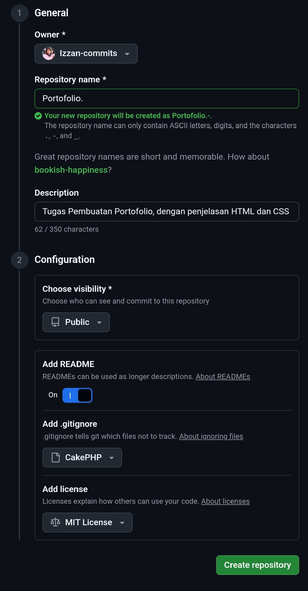
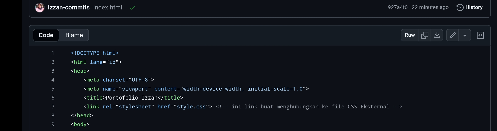
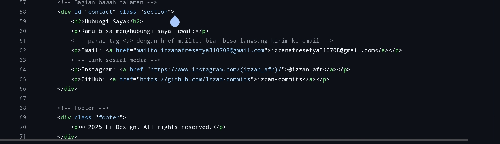

## 🧱PENJELASAN 

## Pembuatan Repositori 

Berikut penjelasan bagian-bagian penting yang ada saat membuat repository:

- **Repository Name** → aku kasih nama `Portofolio.` karena isi repo ini adalah proyek web portofolio.
- **Description** → berisi penjelasan singkat tentang isi repository, misalnya “Tugas Pembuatan Portofolio dengan penjelasan HTML dan CSS”.
- **Visibility** → aku pilih **Public**, supaya orang lain bisa melihat repository ini.
- **Add README** → aku aktifkan, karena file README penting untuk menjelaskan isi proyek.
- **Add .gitignore** → aku biarkan default, biasanya untuk mengabaikan file tertentu yang nggak perlu diunggah.
- **Add License (MIT License)** → lisensi ini memperbolehkan orang lain memakai proyekku, tapi tetap mencantumkan nama pembuatnya.

## Penjelasan Beberapa bagian HTML

PENJELASAN BAGIAN BAGIAN DASAR: 
 

- `
` = pembungkus elemen
- `class` = nama yang dipakai buat ngatur gaya elemen lewat CSS
- `` = Dipakai biar nandain teks tertentu biar bisa dikasih gaya khusus.

Link Untuk CSS Eksternal  

- **Pakai: `<link rel="stylesheet" href="style.css">`** → Buat ngehubungin halaman HTML ke file CSS eksternal.
 

Ini bagian Kontak & Kaki(bawah)  

- **Pakai: `<a href="mailto:ijan@gmail.com">`** → Agar saat di klik langsung membuka email ke alamat yang di cantumkan.
- **Pakai: `<a href="Link Sosial Media">` → Ini buat Sosial Media Kayak Ig atau GitHub
 
 

## Penjelasan Bagian-bagian CSS
`{ margin: 0; }` = Buat ngehapus jarak bawaan dari browser di seluruh halaman.  
`{ background-color: #xx; }` = Ngasih warna latar belakang sesuai warna yang dimasukin.  
`{ float: (position) ; }` = Ngatur tata letak class sesuai posisi yang diinginkan misal right berarti posisi akan di kanan.  
`{ padding: 30px 15px; }` =Ngasih jarak di sekitar isi tiap bagian.  
`{ border: solid}` = Bikin border Solid
`{border-radius: 15px}` = Biar bagian sudut border jadi melengkung.  
`{color}` = Ngatur warna, bisa buat teks, warna border dll.  

## Tampilan:

